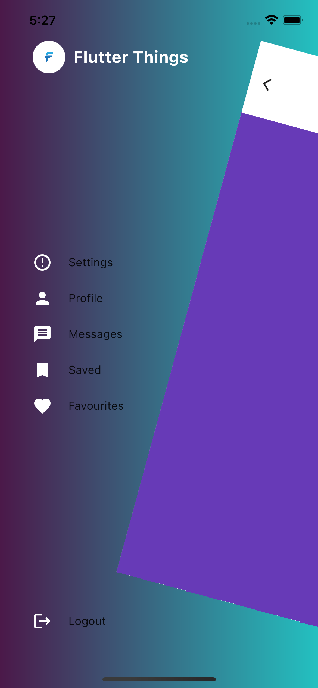

# Flutter Animated Drawer Example

This repository contains a Flutter project demonstrating how to create an animated drawer. An animated drawer provides a smooth transition effect when opening and closing the navigation drawer.


## ScreenShots and GIF
    


## Features

- Implements an animated transition for a more visually appealing drawer experience.
- Provides a basic example of integrating the animated drawer into a Flutter app.


## Installation

Follow these steps to run the app on your local machine:

- Clone this repository
```bash
 git clone https://github.com/SafuRaja7/Animated-Drawer-Flutter.git
```
- Navigate to the project directory:
```bash
 cd animated-drawer-flutter
```
- Install the dependencies:
```bash
 flutter pub get
```
- Run the app:
```bash
 flutter run
```
    
## Feedback

If you have any feedback, please reach out to us at flutterthings7@gmail.com


## Contributing
Contributions are welcome! If you find any issues or have suggestions for improvements, feel free to open an issue or submit a pull request.

